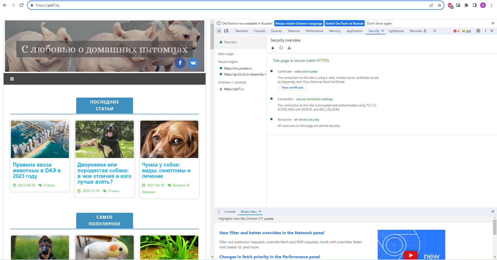
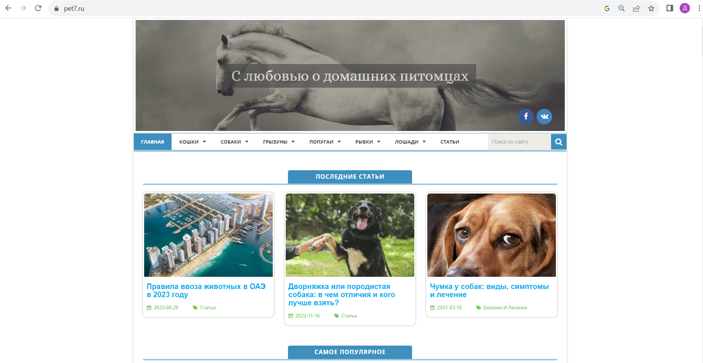
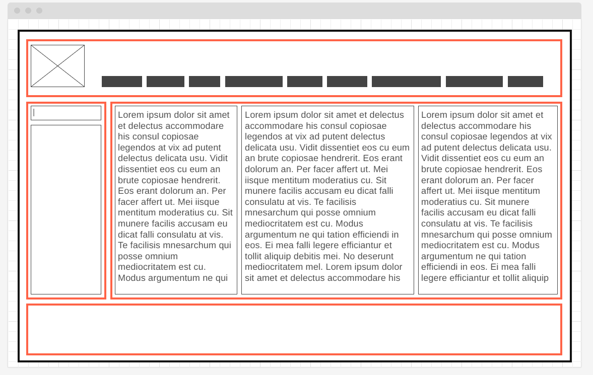

## Домашнее задание к семинару №1
1. Определите, на каком протоколе работает сайт.
2. Проанализируйте структуру страницы сайта. Покажите в коде где хедер, футер и контент.
3. Внесите не менее 3 изменений на страницу с помощью инструмента разработчика и представьте скриншоты было/стало.
4. Создайте прототип низкой детализации.
### 1. Определите, на каком протоколе работает сайт.
Сайт работает на протоколе *https*

### 2. Проанализируйте структуру страницы сайта. Покажите в коде где хедер, футер и контент.

#### Хедер

#### Контент

#### Футер

### 3. Внесите не менее 3 изменений на страницу с помощью инструмента разработчика и представьте скриншоты было/стало.

#### Было

#### Стало

### 4. Создайте прототип низкой детализации.

#### Прототип низкой детализации

